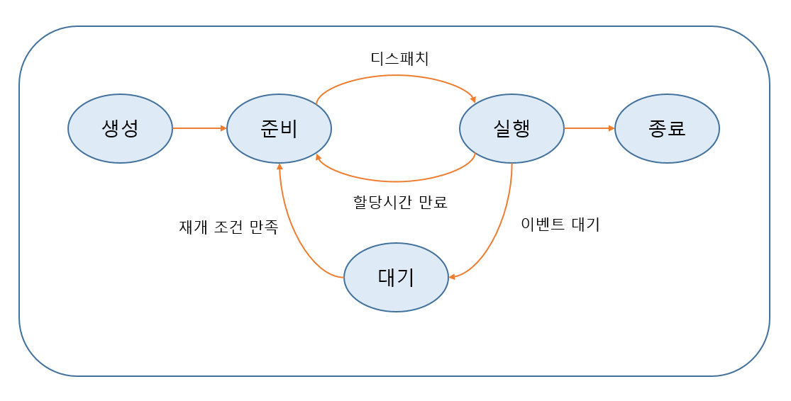
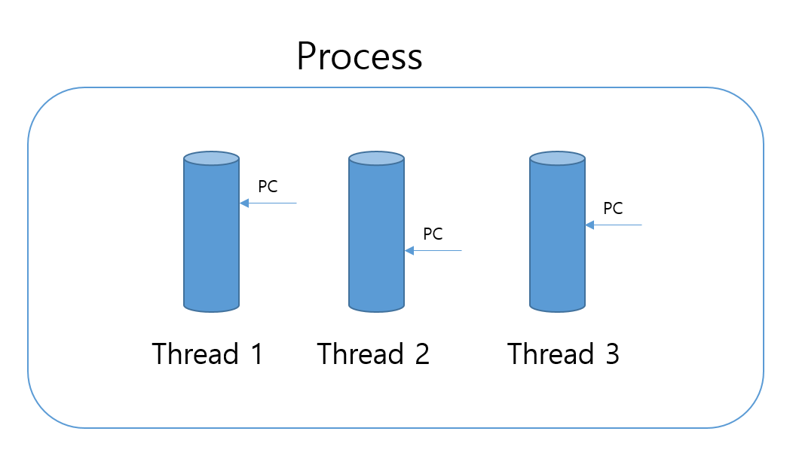

## 1. 프로세스

프로세스는 **실행 중인 프로그램**을 의미한다. 프로그램은 디스크에 존재하는 정적인 파일이지만, 운영체제로부터 자원을 할당받아 실행되면 동적인 프로세스가 된다.

### 1-1. 프로세스의 상태 변화

프로세스는 생성부터 종료까지 다음의 다섯 상태를 오간다.

#### 생성 → 준비
스케줄러에 등록되며, 메모리 사용 가능 여부와 필요한 장치를 점검한다.

#### 준비 → 실행
정해진 스케줄링 알고리즘에 따라 CPU를 할당받아 실행된다. 이를 **디스패치(dispatch)** 라고 한다.

#### 실행 → 준비
할당 시간이 끝나거나, 우선순위에 따라 선점되는 경우 준비 상태로 되돌아간다.

#### 실행 → 대기
입출력(I/O)이나 페이지 교환처럼 시간이 오래 걸리는 작업이 발생하면, CPU를 다른 프로세스에 넘기기 위해 대기 상태로 전환된다.

#### 대기 → 준비
작업 완료 신호가 발생하면 준비 큐로 복귀한다. 페이지 교환 시에는 페이지 인터럽트 핸들러가 메모리 적재 완료를 알린다.

#### 실행 → 종료
정상 종료되거나, 운영체제가 오류를 감지해 강제 종료될 수 있다.

---

### 1-2. 프로세스 제어블록(PCB)

운영체제는 프로세스를 효율적으로 관리하기 위해 **프로세스 제어블록(PCB)** 에 필요한 정보를 저장한다. 프로세스 종료 시 PCB도 함께 제거된다.

#### PCB의 주요 정보
- 프로세스 상태
- 프로세스 번호(PID)
- 고유 식별자
- 프로그램 카운터(PC)
- 다음에 실행할 명령의 주소

#### 레지스터 정보
문맥 교환 시 CPU 레지스터 값을 저장·복원하기 위한 정보가 포함된다.

#### 메모리 관리 정보
프로세스의 주소 공간, 가상 메모리와 실제 메모리 매핑, 기준·경계 레지스터 등이 포함된다.

#### 회계 및 I/O 상태 정보
프로세스의 사용 자원, 수행 시간, 입출력 장치 상태 등 관리 및 성능 측정을 위한 정보가 포함된다.

---

### 1-3. 프로세스 생성과 종료

#### 프로세스 생성
부모 프로세스는 시스템 호출을 통해 자식 프로세스를 생성할 수 있다. 자식은 부모의 자원 일부를 공유하거나 복제해 사용하며, 이는 시스템 과부하를 방지하기 위한 정책이다.

#### 프로세스 종료
부모가 자식의 작업을 더 이상 원하지 않을 때 강제 종료시킬 수 있으며, 부모 프로세스가 종료되면 자식도 연쇄적으로 종료된다.

---

### 1-4. 프로세스 간 관계

#### 독립적 프로세스
- 다른 프로세스와 데이터를 공유하지 않는다.
- 결과가 결정적이며 재실행해도 동일한 결과를 낸다.

#### 유기적(협력) 프로세스
- 다른 프로세스와 데이터를 교환하거나 영향을 주고받는다.
- 비결정적이며 재실행 시 결과가 달라질 수 있다.

---

## 2. 쓰레드

- 쓰레드는 프로세스 내부에서 실행 흐름을 분리한 단위이다.
- 과거에는 프로세스가 자원 소유·디스패칭 역할을 모두 담당했지만, 현대 운영체제에서는 **자원 소유는 프로세스**, **실행 단위는 쓰레드**로 명확히 분리되어 있다.
- 하나의 프로세스는 여러 쓰레드를 가질 수 있다.
- 쓰레드는 실행에 필요한 최소한의 정보만 가지고, 프로세스가 가진 자원(주소 공간, 파일 핸들 등)은 공유한다.
- 멀티코어 환경에서는 여러 쓰레드를 병렬로 실행할 수 있어 성능 향상이 가능하다.

---

## 3. 스케줄링

스케줄링은 CPU가 어떤 작업을 먼저 처리할지 순서를 결정하는 행위이다.

### 스케줄링 정책

운영체제는 공정성과 균형을 고려하여 목표를 설정한다.

- **일괄처리 시스템**
  - 처리량 극대화
  - 반환시간 최소화
  - CPU 활용도 극대화

- **대화형 시스템**
  - 응답 시간 최소화
  - 긴 대기시간 방지

서로 상반되는 목표가 많기 때문에 모두 충족시키기는 어렵다.

---

### 선점 스케줄링

- 실행 중인 프로세스를 중단하고 CPU를 다른 프로세스에 할당한다.
- 우선순위 기반 시스템에서 많이 사용된다.
- 문맥 교환이 잦으면 오버헤드가 증가한다.

### 비선점 스케줄링

- 프로세스가 CPU를 할당받으면 I/O나 종료가 발생하기 전까지 계속 실행된다.
- 응답 시간 예측이 가능하지만, 짧은 작업이 긴 작업을 기다리는 문제가 생길 수 있다.

> 참고: 무한 루프에 빠진 프로세스는 선점/비선점 여부와 관계없이 운영체제가 강제 인터럽트를 발생시켜 제어한다.

---

> 이 시리즈의 모든 포스팅은 직접 수업과 교재를 통해 학습한 내용을 토대로  
> 손으로 정리한 후, **AI를 이용해 구조 정리와 맞춤법만 다듬은 자료**입니다.