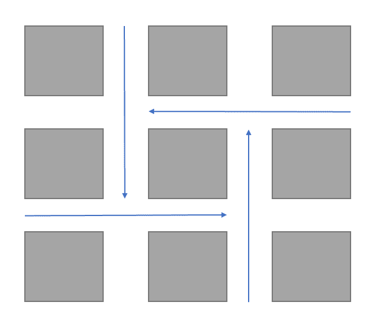

## 1. 교착 상태(Deadlock)의 개념

두 개 이상의 프로세스가 서로 자원 할당을 위해 다른 프로세스의 작업이 끝나기만을 무한하게 기다리고 있는 상태를 의미한다.

- **기아 상태 (Starvation):** 프로세스의 일부가 자원 할당을 받지 못해 대기가 지속적으로 일어나는 현상 (언젠가는 해소될 가능성이 있음)
- **교착 상태 (Deadlock):** 서로가 서로의 자원을 원하여 모든 프로세스의 진행이 완전히 멈춘 상태

<figure style={{ textAlign: 'center' }}>
  
  <figcaption style={{ fontSize: '0.9rem', color: '#666' }}>
    교착 상태의 도식
  </figcaption>
</figure>

## 2. 교착 상태의 특성

### 교착 상태의 필요 조건 (4가지)

교착 상태가 발생하기 위해서는 다음 4가지 조건이 **모두** 충족되어야 한다. 하나라도 충족되지 않으면 교착 상태는 발생하지 않는다.

1. **상호 배제 (Mutual Exclusion)**
    - 자원에 대한 배타적인 통제권을 의미한다. 한 번에 하나의 프로세스만 자원을 사용할 수 있다.
2. **점유 대기 (Hold and Wait)**
    - 자원을 최소한 하나 보유하고(점유), 다른 프로세스가 점유 중인 자원을 얻기 위해 기다리는(대기) 프로세스가 있어야 한다.
3. **비선점 (No Preemption)**
    - 다른 프로세스가 점유 중인 자원을 강제로 빼앗을 수 없다. 자원은 점유하고 있는 프로세스가 자발적으로 반환할 때만 해제된다.
4. **환형 대기 (Circular Wait)**
    - 대기 프로세스의 집합이 서로가 꼬리를 물고 순환 형태로 자원을 대기해야 한다. ($P_0 \to P_1 \to ... \to P_n \to P_0$)

### 자원 할당 그래프 (Resource Allocation Graph)

교착 상태를 명확하게 시각화하기 위해 사용하는 유향 그래프이다.

* **정점 (Vertex)**
    * P: 프로세스(Process)를 의미하는 정점의 집합
    * R: 자원(Resource)을 의미하는 정점의 집합
* **간선 (Edge)**
    * **요구 간선 ($P_i \to R_j$):** 프로세스 $P_i$가 자원 $R_j$를 요청함 (대기)
    * **할당 간선 ($R_j \to P_i$):** 자원 $R_j$가 프로세스 $P_i$에 할당됨 (점유)

<figure style={{ textAlign: 'center' }}>
  
  <figcaption style={{ fontSize: '0.9rem', color: '#666' }}>
    교착 상태를 나타낸 간선 그래프의 예
  </figcaption>
</figure>

## 3. 교착 상태 처리

### 3-1. 방지 (Prevention)

교착 상태 발생 필요 조건 4가지 중 하나를 부정하여 교착 상태를 예방하는 방법이다.

* **상호 배제 조건의 제거**
    * 공유 가능한 자원(Read-only 파일 등)으로 만들면 되지만, 근본적으로 공유 불가능한 자원(프린터 등)이 존재하므로 사실상 불가능하다.
* **점유 대기 조건의 제거**
    * 자원을 요청하는 시점에 어떠한 다른 자원도 점유하고 있지 않아야 한다.
    * **방법 1:** 작업을 시작하는 시점에 필요한 모든 자원을 한꺼번에 요청하여 할당받는다. (자원 효율성 저하)
    * **방법 2:** 자원이 필요할 때 보유 자원을 모두 내려놓고 다시 요청한다. (기아 상태 유발 가능)
* **비선점 조건의 제거**
    * **방법 1:** 다른 자원을 요청했으나 즉시 할당받지 못하는 경우, 점유 중이던 모든 자원을 반환하고 대기한다.
    * **방법 2:** 요청한 자원이 다른 대기 중인 프로세스에 의해 점유되어 있다면, 그 자원을 선점(빼앗음)하여 가져온다.
    * CPU 레지스터나 메모리처럼 상태 저장이 쉬운 자원에만 적용 가능하다.
* **환형 대기 조건의 제거**
    * 모든 자원 유형에 일련번호를 부여하고, **오름차순**으로만 자원을 요청하게 한다.
    * 예: 3번 자원을 보유한 상태에서는 1번 자원을 요청할 수 없고, 반드시 4번 이상의 자원만 요청 가능하다.

### 3-2. 회피 (Avoidance)

프로세스의 자원 사용에 대한 **사전 정보**를 활용하여, 교착 상태가 발생할 가능성이 있는 불안전 상태를 피해 가는 방법이다.

* **필요한 사전 정보:** 할당된 자원, 가용 자원, 프로세스들의 **최대 요구량(Max Need)**
* **안전 상태 (Safe State):** 시스템이 교착 상태를 일으키지 않으면서 각 프로세스가 요구한 최대 자원까지 모두 할당해 줄 수 있는 안전 순서열이 존재하는 상태.

#### 안전 순서열 (Safe Sequence)
프로세스 집합 $P = \{p_1, p_2, \dots, p_n\}$에 관하여, **$p_i$가 추가로 요구하는 자원이 '현재 가용 자원' + '모든 $p_j (j < i)$가 반납할 자원'으로 충족 가능**하다면 안전 순서열이 존재한다고 한다.

#### 은행원 알고리즘 (Banker's Algorithm)
단위 자원이 여러 개일 때 사용하는 기법이다. 자원 요청이 들어오면 **"가상으로 할당해 보고, 그 후에도 안전 상태인지(안전 순서열이 존재하는지)"** 검사하여 안전하다면 할당, 아니면 대기한다.

**데이터 구조:**
1.  `Available`: 가용 자원
2.  `Max`: 프로세스 별 최대 요구량
3.  `Allocation`: 현재 할당된 자원량
4.  `Need`: 앞으로 필요한 자원량 (`Max` - `Allocation`)

**알고리즘 동작 로직 (의사코드):**
```text
1. 요청 검사 (Request <= Need)
   - 프로세스가 자신의 최대 요구량을 초과해서 요청했는지 확인 (초과 시 오류)

2. 가용 자원 검사 (Request <= Available)
   - 현재 시스템에 남은 자원으로 처리 가능한지 확인 (부족하면 대기)

3. 가상 할당 (Simulation)
   Available = Available - Request
   Allocation = Allocation + Request
   Need = Need - Request

4. 안전성 검사 (Safety Check)
   - 변경된 상태에서 모든 프로세스를 끝낼 수 있는 '안전 순서열'이 존재하는지 확인

5. 결정
   - 안전하다면(Safe) -> 실제 할당 수행
   - 불안전하다면(Unsafe) -> 상태를 원상 복구하고 프로세스 대기
```

#### 각 유형의 단위 자원이 하나밖에 없을 경우
은행원 알고리즘은 복잡도($m \times n^2$)가 높으므로, 단위 자원이 하나인 시스템에서는 **자원 할당 그래프**에서 **사이클(Cycle)**이 발생하는지를 탐지하여 회피한다.

### 3-3. 교착 상태의 탐지 및 복구 (Detection & Recovery)

교착 상태 방지나 회피는 비용이 크기 때문에, 시스템은 주기적으로 교착 상태 발생 여부를 **탐지**하고 발생 시 **복구**하는 방법을 사용하기도 한다.

**복구 전략:**
1.  **프로세스 종료:**
    * 교착 상태에 빠진 **모든** 프로세스 종료 (비용 큼, 데이터 손실 위험)
    * 사이클이 제거될 때까지 **하나씩** 프로세스 종료 (종료할 때마다 탐지 알고리즘 재수행 필요)
2.  **자원 선점:**
    * 희생자(Victim)를 선택하여 자원을 빼앗고 롤백시킨다. (기아 상태 발생 가능성 고려 필요)


## 4. 복합적 접근 (Combined Approach)

운영체제는 효율성을 위해 방지, 회피, 탐지 기법을 자원의 특성에 따라 복합적으로 사용한다.

| 자원 유형 | 권장 처리 기법 | 이유 및 상세 |
| :--- | :--- | :--- |
| **내부 자원**(PCB 등) | **방지**(순서 부여) | 자원 요청 순서를 정하여 환형 대기를 방지한다. |
| **메모리 / CPU** | **방지**(선점 허용) | 작업 컨텍스트를 저장하고 복구하기 쉬우므로 선점을 통해 해결한다. |
| **작업용 자원**(테이프, 프린터 등) | **회피** | 작업 제어 카드 등을 통해 필요한 자원 정보를 미리 알 수 있으므로 회피 기법이 적절하다. |
| **교체 가능 공간**(보조기억장치) | **회피**(사전 할당) | 기억장치의 최대 사용량을 미리 알 수 있으므로 미리 할당하는 방식을 쓴다. |

> 이 시리즈의 모든 포스팅은 직접 수업과 교재를 통해 학습한 내용을 토대로  
> 손으로 정리한 후, **AI를 이용해 구조 정리와 맞춤법만 다듬은 자료**입니다.