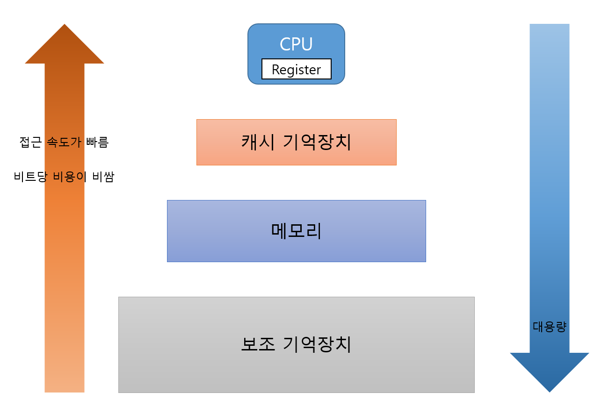
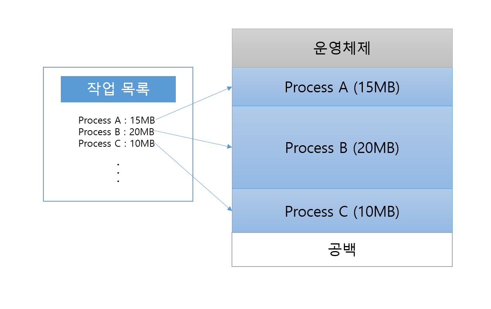

## 1. 프로세스와 메모리

프로세스가 동작하기 위해서는 CPU와 메모리가 필수적이다. 프로세스는 실행 중 프로그램 카운터(PC)가 가리키는 명령어를 읽어와서 실행하는데, 이때 PC가 참조하는 저장 공간이 바로 메모리이다.

<figure style={{ textAlign: 'center' }}>
  
  <figcaption style={{ fontSize: '0.9rem', color: '#666' }}>
    단순한 형태의 메모리 구조
  </figcaption>
</figure>

<figure style={{ textAlign: 'center' }}>
  
  <figcaption style={{ fontSize: '0.9rem', color: '#666' }}>
    기억장치 계층구조
  </figcaption>
</figure>

## 2. 단일 프로그래밍 환경

초기의 단일 프로그래밍 환경에서는 하나의 프로세스만 메모리를 사용하였다. 따라서 하나의 프로세스가 메모리에 연속된 블록으로 할당되는 연속 메모리 할당 방식을 이용하였다.

### 단점

- 메모리 용량을 초과하는 프로세스는 실행될 수 없다.
- 사용되지 않는 프로세스나 데이터도 메모리에 적재되어 있어야 한다.
- 한 명의 유저가 메모리를 독점하고 있으므로 주변장치 등 자원의 낭비가 심하다.

<figure style={{ textAlign: 'center' }}>
  
  <figcaption style={{ fontSize: '0.9rem', color: '#666' }}>
    단일 프로그래밍 환경에서의 CPU 이용
  </figcaption>
</figure>

## 3. 다중 프로그래밍 환경의 메모리 분할

여러 프로세스를 메모리에 적재하고 사용하려면 메모리를 여러 영역으로 나누어 적재해야 한다. 이를 위한 방식은 크게 **고정 분할** 방식과 **동적 분할** 방식으로 구분할 수 있다.

### 1) 고정 분할 (Fixed Partitioning)

고정 분할은 이름 그대로 메모리를 여러 개의 고정된 크기의 영역으로 미리 나누어 놓는 방식이다.

<figure style={{ textAlign: 'center' }}>
  
  <figcaption style={{ fontSize: '0.9rem', color: '#666' }}>
    고정 분할의 예
  </figcaption>
</figure>

고정 분할된 메모리에 프로세스를 할당하기 위해 두 가지 전략을 사용할 수 있다.

**첫 번째 방법: 다중 큐 (Multiple Queues)**
각 분할된 영역마다 전용 큐를 두고, 해당 파티션에 맞는 프로세스만 적재하는 방식이다. 각 프로세스가 실행될 파티션이 정해져 있으므로 컴파일 시점에 **절대 주소**를 사용한다. 구현은 단순하지만, 특정 파티션은 비어 있는데 다른 파티션은 꽉 차서 대기해야 하는 비효율이 발생할 수 있다.

<figure style={{ textAlign: 'center' }}>
  
  <figcaption style={{ fontSize: '0.9rem', color: '#666' }}>
    절대주소를 이용
  </figcaption>
</figure>

**두 번째 방법: 단일 큐 (Single Queue)**
메모리 진입점에 하나의 통합 큐를 두고, 어느 분할 영역이든 비어 있으면 프로세스를 적재하는 방식이다. 프로세스가 어느 주소 공간에 적재될지 미리 알 수 없으므로 **상대 주소(재배치 가능 코드)** 를 사용해야 하며, 주소 변환을 위한 운영체제의 구현이 복잡해진다.

> **단점:** 고정 분할에서는 분할된 메모리 영역의 크기보다 적재된 프로세스의 크기가 작아, 분할 영역 내부의 공간이 낭비되는 **내부 단편화(Internal Fragmentation)** 문제가 발생한다.

### 2) 동적 분할 (Dynamic Partitioning)

메모리 분할 경계가 고정되지 않고, 각 프로세스가 필요로 하는 크기만큼만 딱 맞게 메모리를 할당하는 방식이다.

<figure style={{ textAlign: 'center' }}>
  
  <figcaption style={{ fontSize: '0.9rem', color: '#666' }}>
    동적분할의 예
  </figcaption>
</figure>

동적 분할은 프로세스 크기에 맞춰 메모리를 할당하기 때문에 내부 단편화 문제는 일어나지 않는다. 하지만 프로세스의 할당과 종료가 반복됨에 따라, 프로세스 사이사이에 작은 크기의 빈 공간들이 흩어지는 **외부 단편화(External Fragmentation)** 문제가 발생한다.

<figure style={{ textAlign: 'center' }}>
  
  <figcaption style={{ fontSize: '0.9rem', color: '#666' }}>
    외부 단편화의 예시
  </figcaption>
</figure>

외부 단편화를 해결하는 방법으로는 통합과 집약이 있다.

- **통합(Coalescing):** 인접해 있는 빈 공간(공백)들을 합쳐 더 큰 하나의 공백으로 만든다.
- **집약(Compaction):** 메모리 내의 사용 중인 공간을 한쪽으로 몰아, 흩어져 있는 모든 공백을 하나의 큰 덩어리로 모으는 작업이다. (오버헤드가 크다)

## 4. 메모리 보호

메모리 상에 여러 프로세스가 동시에 상주하므로, 특정 프로세스가 다른 프로세스의 메모리 영역이나 운영체제 영역을 침범하지 않도록 보호해야 한다.

이를 위해 **기준 레지스터(Base Register)** 와 **한계 레지스터(Limit Register)** 쌍을 사용하여 CPU가 현재 실행 중인 프로세스의 유효한 주소 범위를 참조하고 있는지 하드웨어적으로 검사한다. 이 범위를 벗어나는 메모리 공간에 접근하려면 운영체제의 시스템 호출(System Call)을 이용해야 한다.

## 5. 메모리 배치 기법

새로운 프로세스나 데이터를 적재할 때, 메모리의 빈 공간 중 어디에 배치할 것인지를 결정하는 전략이다.

1. **최초 적합 (First Fit)**
    - 메모리의 처음부터 검색하여, 프로세스가 들어갈 수 있는 빈 공간 중 **첫 번째로 발견된 공간**에 적재한다.
    - 검색 속도가 빠르다.

2. **후속 적합 (Next Fit)**
    - 최초 적합과 유사하지만, 매번 처음부터 검색하지 않고 **마지막으로 할당했던 위치 다음부터 검색**을 시작한다.
    - 메모리 영역을 골고루 사용하게 된다.

3. **최적 적합 (Best Fit)**
    - 프로세스가 적재될 수 있는 빈 공간 중, **가장 크기가 비슷한(여유 공간이 가장 적게 남는) 공간**에 적재한다.
    - 외부 단편화로 인해 아주 작은 조각들이 많이 발생할 수 있다.

4. **최악 적합 (Worst Fit)**
    - 최적 적합과 반대로, 프로세스가 적재될 수 있는 공간 중 **가장 큰 공간**에 적재한다.
    - 남은 공간도 충분히 커서 다른 프로세스가 사용할 수 있도록 하려는 의도이지만, 큰 가용 공간이 빨리 사라지는 단점이 있다.