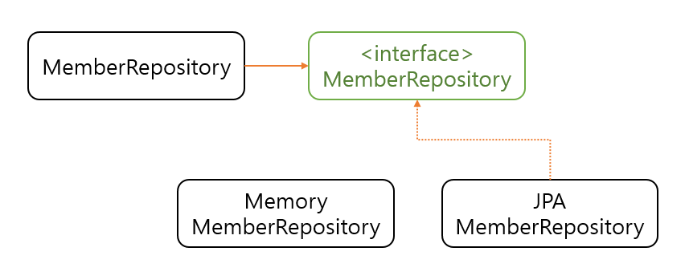
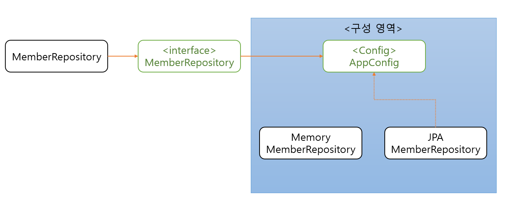

> 💡Reference [[외부 링크]'스프링 핵심원리 - 기본편'](https://inf.run/n6jw)  
> 1. **스프링 기본 1 - DIP, OCP 원칙과 스프링 컨테이너**  
> 2. [스프링 기본 2 - 싱글톤 패턴과 싱글톤 컨테이너](../spring-기본-2/)  
> 3. [스프링 기본 3 - 빈 스코프와 생명주기](../spring-기본-3)

## 1. 개요
데이터베이스가 정해지지 않아서 임시 메모리 저장소를 구현해서 개발하던 중, DB가 확정되고 JPA로 레포지터리 레이어를 구현한다고 가정한다. DI 컨테이너, 혹은 스프링 컨테이너에 대해 공부하기 전에는 의존관계를 직접 구현체를 설정하여 지정해 주었지만, 이는 SOLID 5원칙 중 DIP, OCP에 위배되는 방식이다. 그렇다면 객체지향적인 설계를 위해서는 어떻게 해야 할까?

<figure style={{ textAlign: 'center' }}>
  
  <figcaption style={{ fontSize: '0.9rem', color: '#666' }}>
    변경 전
  </figcaption>
</figure>

<figure style={{ textAlign: 'center' }}>
  
  <figcaption style={{ fontSize: '0.9rem', color: '#666' }}>
    변경 후
  </figcaption>
</figure>

## 2. 스프링이 없다고 가정하면
먼저 우리가 최종적으로 성공해야 하는 테스트 코드를 먼저 작성해보자.

```java
class MemberServiceImplTest {

    MemberService memberService = new MemberServiceImpl();

    @Test
    @DisplayName("회원가입 성공")
    void join() {
        Member member = new Member("name", MemberGrade.USER);

        Long joinedId = memberService.join(member);

        Member findMember = memberService.findOne(joinedId).get();
        Assertions.assertThat(findMember.getId()).isEqualTo(member.getId());
        Assertions.assertThat(findMember.getGrade())
            .isEqualTo(member.getGrade());
    }
}
```

만약 스프링의 기능 없이 구현체를 설정한다고 하면 다음과 같이 다형성을 이용할 수 있다.

```java
public class MemberServiceImpl implements MemberService {

    private MemberRepository memberRepository = new JpaMemberRepository();
}
```

하지만 위와 같은 코드는 DIP, OCP 원칙에 위배된다.

> ☝️DIP - 의존관계 역전 원칙  
> 추상화에 의존해야 하고, 구체화에 의존하면 안 된다.  

> ☝️OCP - 개방-폐쇄 원칙  
> 확장에는 열려 있으나 변경에는 닫혀 있어야 한다.

서비스 객체는 비즈니스 로직에 집중해야 하고 내부에서 구현체를 선택하면 안 된다.

그래서 직접적인 의존성 주입 코드를 제거해보자.

```java
public class MemberServiceImpl implements MemberService {

    private MemberRepository memberRepository;
}
```

이제 `memberRepository` 객체를 사용할 때 NPE가 발생한다. 이를 해결하기 위해 Config 객체의 개념이 등장한다.

```java
public class MemberConfig {

    public MemberRepository memberRepository() {
        return new JpaMemberRepository();
    }

    public MemberService memberService() {
        return new MemberServiceImpl(memberRepository());
    }
}
```

Config 객체가 모든 의존성 선택 책임을 맡는다.

```java
public class MemberServiceImpl implements MemberService {

    private MemberRepository memberRepository;

    public MemberServiceImpl(MemberRepository memberRepository) {
        this.memberRepository = memberRepository;
    }
}
```

```java
@BeforeEach
void beforeEach() {
    MemberConfig memberConfig = new MemberConfig();
    this.memberService = memberConfig.memberService();
}
```

이 구조를 IoC(Inversion of Control), DI 컨테이너라고 한다.

<figure style={{ textAlign: 'center' }}>
  
  <figcaption style={{ fontSize: '0.9rem', color: '#666' }}>
    DI 컨테이너
  </figcaption>
</figure>

## 3. 스프링 컨테이너
스프링 컨테이너는 객체들을 스프링 빈으로 등록해 관리한다. Spring Boot 애플리케이션은 시작할 때 컴포넌트 스캔을 실행해 빈을 자동 등록한다.

### 3.1 수동 등록

```java
@Configuration
public class MemberConfig {

    @Bean
    public MemberRepository memberRepository() {
        return new MemoryMemberRepository();
    }

    @Bean
    public MemberService memberService() {
        return new MemberServiceImpl(memberRepository());
    }
}
```

```java
public class ApplicationContextTest {

    AnnotationConfigApplicationContext ac = new AnnotationConfigApplicationContext(MemberConfig.class);

    @Test
    void findMemberServiceBean() {
        MemberService memberService = ac.getBean(MemberService.class);
        Assertions.assertThat(memberService).isInstanceOf(MemberServiceImpl.class);
    }
}
```

### 3.2 자동 등록
자동 등록 대상은 `@Component`, `@Service`, `@Repository`, `@Configuration` 등이다.

```java
@Configuration
@ComponentScan(
        basePackages = "jwjung.spring.remind",
        excludeFilters = @ComponentScan.Filter(
            type = FilterType.ANNOTATION, classes = Configuration.class
        )
)
public class MemberAutoConfig {}
```

<figure style={{ textAlign: 'center' }}>
  
  <figcaption style={{ fontSize: '0.9rem', color: '#666' }}>
    컴포넌트 스캔 결과
  </figcaption>
</figure>

두 구현체가 동시에 존재하면 `NoUniqueBeanDefinitionException`이 발생한다.

#### 해결 1: @Primary

```java
@Repository
@Primary
public class MemoryMemberRepository implements MemberRepository {}
```

#### 해결 2: @Qualifier

```java
@Repository
@Qualifier("memoryMemberRepository")
public class MemoryMemberRepository implements MemberRepository {}

@Repository
@Qualifier("jpaMemberRepository")
public class JpaMemberRepository implements MemberRepository {}

@Service
public class MemberServiceImpl implements MemberService {

    public MemberServiceImpl(@Qualifier("memoryMemberRepository") MemberRepository memberRepository) {
        this.memberRepository = memberRepository;
    }
}
```

## 4. 마무리
지금까지 스프링의 빈 관련 기능을 살펴보았다. 스프링 컨테이너와 DI 흐름을 이해하면 전체적인 구조를 명확히 이해할 수 있다.

> 이 시리즈의 모든 포스팅은 직접 수업과 교재를 통해 학습한 내용을 토대로  
> 손으로 정리한 후, **AI를 이용해 구조 정리와 맞춤법만 다듬은 자료**입니다.
